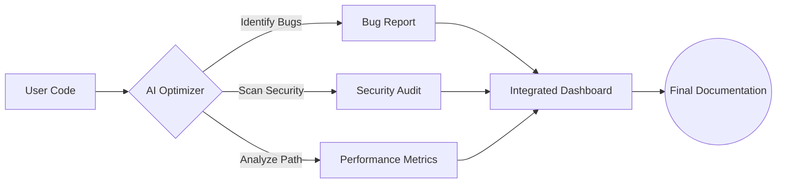
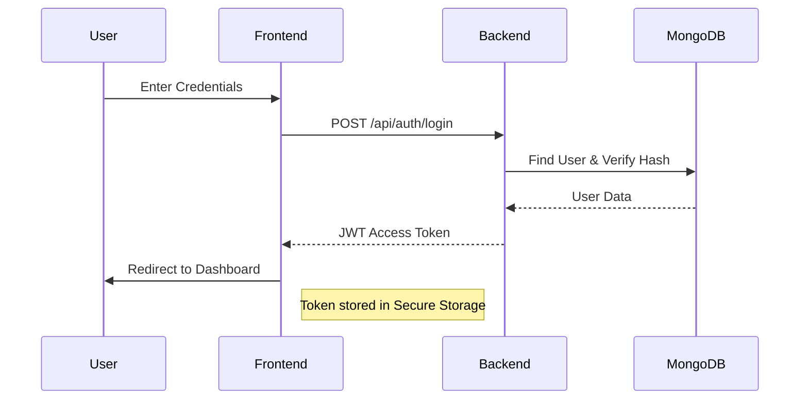
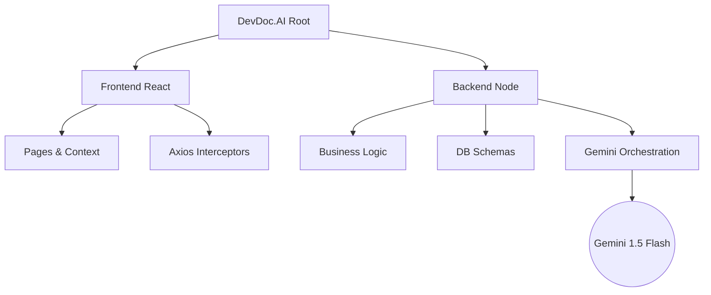

# 🛡️ DevDoc.AI - Your Elite AI-Powered Code Companion

[](https://react.dev/)
[](https://nodejs.org/)
[](https://deepmind.google/technologies/gemini/)
[](https://opensource.org/licenses/MIT)

> **Revolutionize your development workflow with AI-driven insights, security audits, and architectural analysis.**

[🚀 Live Demo](https://devdoc-ai-frontend.vercel.app/) • [📄 Project Wiki](#-what-is-devdocai) • [✨ Key Features](#-key-features) • [🛠️ Setup Guide](#🚀-getting-started)

---

## 📖 Table of Contents
- [🌟 Introduction & What is DevDoc.AI](#-introduction--what-is-devdocai)
- [✨ Key Features & Visualizations](#-key-features--visualizations)
- [🎨 UI & Animation Excellence](#-ui--animation-excellence)
- [🔐 Authentication Flow](#-authentication-flow)
- [🖼️ Project Preview](#️-project-preview)
- [🚀 Tech Stack & System Architecture](#-tech-stack--system-architecture)
- [📁 File Structure](#-file-structure)
- [🛠️ Project Setup & Installation](#️-project-setup--installation)
- [👤 Author & Contributions](#-author--contributions)
- [📝 License](#-license)

---

## 🌟 Introduction & What is DevDoc.AI?

In simple terms, **DevDoc.AI** is like having a **Senior Software Engineer** sitting right next to you, reviewing your work 24/7. 

Writing code is hard, but keeping that code healthy, secure, and easy to read is even harder. As projects grow, it becomes easy to miss small bugs, leave security "doors" open, or let the codebase become so messy that nobody understands it anymore.

**DevDoc.AI solves this by becoming your project's personal doctor.** You give it a piece of code or a link to your GitHub project, and it performs a "Full Body Scan." Within seconds, it tells you:
- "Hey, this part of the code might crash under heavy load."
- "Wait! You've left a security vulnerability here that a hacker could use."
- "I can explain this complex function to you in plain English so you don't have to guess."

Whether you are a student learning to code better or a professional trying to speed up your reviews, DevDoc.AI provides the **peace of mind** that your project is built on a solid, professional foundation.

---

## ✨ Key Features & Visualizations

### 🚀 Advanced Toolset & Usage
| Tool | What it Does | Why Use It? (Benefits) |
| :--- | :--- | :--- |
| **🔍 Code Review** | Deep analysis of code structure and style. | Improves readability and ensures you're following industry standards. |
| **🐛 Bug Detector** | Scans for potential logic errors and runtime crashes. | Catch mistakes *before* they reach your users. |
| **�️ Security Scanner** | Identifies vulnerabilities like SQL injection or data leaks. | Protects your user data and keeps your application safe from attacks. |
| **⚡ Performance** | Checks for slow operations or memory-heavy code. | Makes your app faster and ensures it can handle many users. |
| **📈 Code Quality** | Scores your code based on maintainability. | Tells you how easy it will be to change your code in the future. |
| **� Architecture** | Analyzes how different parts of your app talk to each other. | Keeps your project organized so it doesn't become "spaghetti code." |
| **📁 GitHub Sync** | Pulls and analyzes an entire repository instantly. | Get a high-level health report of any public project in seconds. |
| **� Debug Assistant**| Analyzes error messages and stack traces. | Stops the "trial and error" loop and tells you exactly how to fix a crash. |
| **📄 Code Explainer**| Translates complex logic into simple English. | Perfect for learning new languages or understanding old, messy code. |

### 🔄 Project Workflow Visualization


---

## 🎨 UI & Animation Excellence

DevDoc.AI is built with a **Premium Dark Aesthetic** that prioritizes focus and visual comfort.
- **Glassmorphism**: Translucent navbars and cards with backdrop-blur effects.
- **Micro-animations**: Smooth hover transitions and loading states powered by Framer Motion.
- **Responsive Layout**: A fluid grid system that feels native on mobile and cinematic on ultra-wide monitors.
- **Dynamic Charts**: Project health trends visualized through animated Chart.js instances.

---

## 🔐 Authentication Flow

We implement a robust, stateless authentication system using JSON Web Tokens (JWT).



---
---

## 🚀 Tech Stack & System Architecture

### 🛠️ Core Technologies
- **Frontend**: `React 19`, `Vite`, `Tailwind CSS v3`, `Lucide Icons`
- **Backend**: `Node.js`, `Express.js`, `Mongoose`
- **AI Engine**: `Google Generative AI (Gemini 1.5 Flash)`, `Groq SDK`
- **Database**: `MongoDB Atlas` (Cloud)
- **State Management**: `React Context API`

### 🏗️ System "Tree" Visualization


---

## 📁 File Structure

```text
devdoctor-ai/
├── 📁 backend/
│   ├── 📁 config/          # Database & Cloud connections
│   ├── 📁 controllers/     # AI Logic & Auth handlers
│   ├── 📁 middleware/      # JWT & Error handlers
│   ├── 📁 models/          # User & Report schemas
│   ├── 📁 services/        # Gemini API integration
│   └── 📄 server.js        # Main entry point
├── 📁 frontend/
│   ├── 📁 src/
│   │   ├── 📁 components/  # Layouts, Sidebar, Editor
│   │   ├── 📁 context/     # Auth & Theme states
│   │   └── 📁 pages/       # Dashboard & AI Tool views
│   └── 📄 tailwind.config.js
└── � docs/                # Assets & Documentation
```

---

## �️ Project Setup & Installation

### 1️⃣ Prerequisites
- **Node.js 18+** installed
- **MongoDB** (Local or Atlas Atlas)
- **Gemini API Key** from [Google AI Studio](https://aistudio.google.com/)

### 2️⃣ Installation Steps

**Clone the repository:**
```bash
git clone https://github.com/your-username/devdoctor-ai.git
cd devdoctor-ai
```

**Set up Backend:**
```bash
cd backend
npm install
# Create .env and add your MONGO_URI, JWT_SECRET, and GEMINI_API_KEY
npm start
```

**Set up Frontend:**
```bash
cd ../frontend
npm install
npm run dev
```

---

## 👤 Author & Contributions

### 👨‍💻 Author
**Saurav Chaudhari**
- 🌐 [Portfolio](https://yourportfolio.com)
- 💼 [LinkedIn](https://www.linkedin.com/in/saurav-chaudhari-1ab838265/)
- 📧 [Email](mailto:srchaudhari0806@gmail.com)

### 🤝 Contributing
Contributions are what make the open-source community such an amazing place to learn, inspire, and create. Any contributions you make are **greatly appreciated**.

1. Fork the Project
2. Create your Feature Branch (`git checkout -b feature/AmazingFeature`)
3. Commit your Changes (`git commit -m 'Add some AmazingFeature'`)
4. Push to the Branch (`git push origin feature/AmazingFeature`)
5. Open a Pull Request

---

## � License

Distributed under the **MIT License**. See `LICENSE` for more information.

---
**Crafted with precision for the modern developer ecosystem.**
