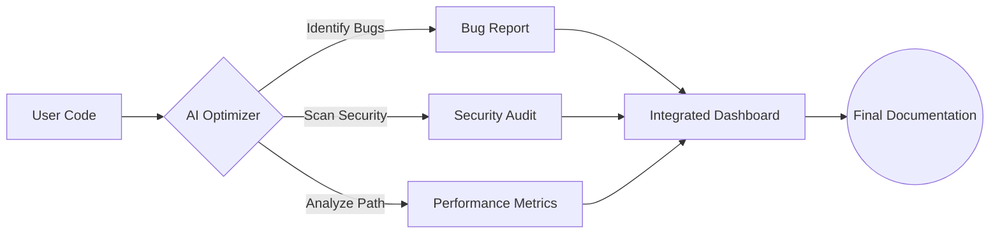
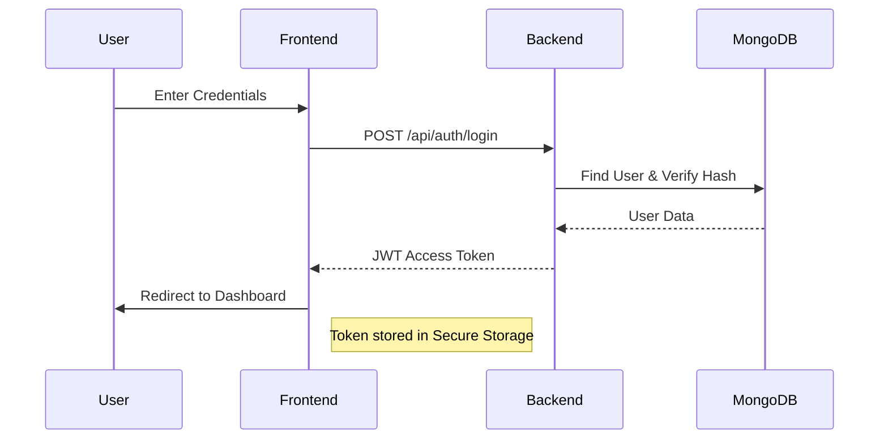
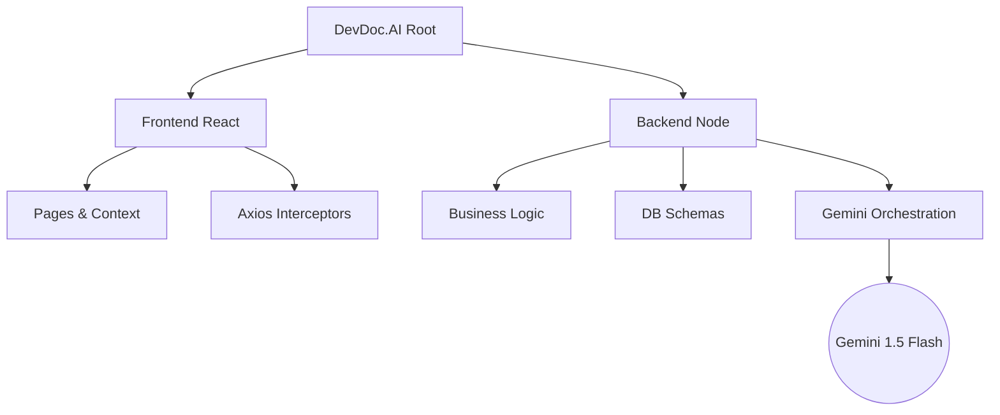

# 🛡️ DevDoc.AI - Your Elite AI-Powered Code Companion

[](https://react.dev/)
[](https://nodejs.org/)
[](https://deepmind.google/technologies/gemini/)
[](https://opensource.org/licenses/MIT)

> **Revolutionize your development workflow with AI-driven insights, security audits, and architectural analysis.**

[🚀 Live Demo](https://devdoc-ai.vercel.app) • [📄 Project Wiki](#-what-is-devdocai) • [✨ Key Features](#-key-features) • [🛠️ Setup Guide](#🚀-getting-started)

---

## 📖 Table of Contents
- [🌟 Introduction & What is DevDoc.AI](#-introduction--what-is-devdocai)
- [✨ Key Features & Visualizations](#-key-features--visualizations)
- [🎨 UI & Animation Excellence](#-ui--animation-excellence)
- [🔐 Authentication Flow](#-authentication-flow)
- [🖼️ Project Preview](#️-project-preview)
- [🚀 Tech Stack & System Architecture](#-tech-stack--system-architecture)
- [📁 File Structure](#-file-structure)
- [🛠️ Project Setup & Installation](#️-project-setup--installation)
- [👤 Author & Contributions](#-author--contributions)
- [📝 License](#-license)

---

## 🌟 Introduction & What is DevDoc.AI?

**DevDoc.AI** is a premium, full-stack SaaS platform designed for modern software engineers. It acts as an automated "Technical Consultant," analyzing codebases in real-time to detect bugs, optimize performance, and ensure security compliance.

### Why DevDoc.AI?
In the fast-paced world of software development, code quality often takes a backseat to feature delivery. DevDoc.AI bridges this gap by providing:
- **Instant Code Audits**: No more waiting for manual peer reviews.
- **Deep Security Intelligence**: Identify vulnerabilities before they are exploited.
- **Architectural Clarity**: Understand complex folder structures and decoupling patterns instantly.

---

## ✨ Key Features & Visualizations

### 🚀 Feature Roadmap
| Feature | AI Model | Visualization |
| :--- | :--- | :--- |
| **Code Review** | Gemini 1.5 Flash | 🔍 Best Practices & Naming |
| **Bug Detector** | Gemini 1.5 Flash | 🐛 Logic & Runtime Errors |
| **Security Scan** | Gemini 1.5 Flash | 🛡️ OWASP & Vulnerabilities |
| **GitHub Sync** | GitHub REST API | 📁 Repo-wide Analysis |
| **Code Explainer**| Gemini 1.5 Flash | 📄 Educational Walkthroughs |

### 🔄 Project Workflow Visualization


---

## 🎨 UI & Animation Excellence

DevDoc.AI is built with a **Premium Dark Aesthetic** that prioritizes focus and visual comfort.
- **Glassmorphism**: Translucent navbars and cards with backdrop-blur effects.
- **Micro-animations**: Smooth hover transitions and loading states powered by Framer Motion.
- **Responsive Layout**: A fluid grid system that feels native on mobile and cinematic on ultra-wide monitors.
- **Dynamic Charts**: Project health trends visualized through animated Chart.js instances.

---

## 🔐 Authentication Flow

We implement a robust, stateless authentication system using JSON Web Tokens (JWT).



---

## 🖼️ Project Preview

### 🏠 Landing Page & Hero Section


### 📊 Real-time Analytics Dashboard


---

## 🚀 Tech Stack & System Architecture

### 🛠️ Core Technologies
- **Frontend**: `React 19`, `Vite`, `Tailwind CSS v3`, `Lucide Icons`
- **Backend**: `Node.js`, `Express.js`, `Mongoose`
- **AI Engine**: `Google Generative AI (Gemini 1.5 Flash)`, `Groq SDK`
- **Database**: `MongoDB Atlas` (Cloud)
- **State Management**: `React Context API`

### 🏗️ System "Tree" Visualization


---

## 📁 File Structure

```text
devdoctor-ai/
├── 📁 backend/
│   ├── 📁 config/          # Database & Cloud connections
│   ├── 📁 controllers/     # AI Logic & Auth handlers
│   ├── 📁 middleware/      # JWT & Error handlers
│   ├── 📁 models/          # User & Report schemas
│   ├── 📁 services/        # Gemini API integration
│   └── 📄 server.js        # Main entry point
├── 📁 frontend/
│   ├── 📁 src/
│   │   ├── 📁 components/  # Layouts, Sidebar, Editor
│   │   ├── 📁 context/     # Auth & Theme states
│   │   └── 📁 pages/       # Dashboard & AI Tool views
│   └── 📄 tailwind.config.js
└── � docs/                # Assets & Documentation
```

---

## �️ Project Setup & Installation

### 1️⃣ Prerequisites
- **Node.js 18+** installed
- **MongoDB** (Local or Atlas Atlas)
- **Gemini API Key** from [Google AI Studio](https://aistudio.google.com/)

### 2️⃣ Installation Steps

**Clone the repository:**
```bash
git clone https://github.com/your-username/devdoctor-ai.git
cd devdoctor-ai
```

**Set up Backend:**
```bash
cd backend
npm install
# Create .env and add your MONGO_URI, JWT_SECRET, and GEMINI_API_KEY
npm start
```

**Set up Frontend:**
```bash
cd ../frontend
npm install
npm run dev
```

---

## 👤 Author & Contributions

### 👨‍💻 Author
**[Your Name / Username]**
- 🌐 [Portfolio](https://yourportfolio.com)
- 💼 [LinkedIn](https://linkedin.com/in/yourprofile)
- 📧 [Email](mailto:youremail@example.com)

### 🤝 Contributing
Contributions are what make the open-source community such an amazing place to learn, inspire, and create. Any contributions you make are **greatly appreciated**.

1. Fork the Project
2. Create your Feature Branch (`git checkout -b feature/AmazingFeature`)
3. Commit your Changes (`git commit -m 'Add some AmazingFeature'`)
4. Push to the Branch (`git push origin feature/AmazingFeature`)
5. Open a Pull Request

---

## � License

Distributed under the **MIT License**. See `LICENSE` for more information.

---
**Crafted with precision for the modern developer ecosystem.**
